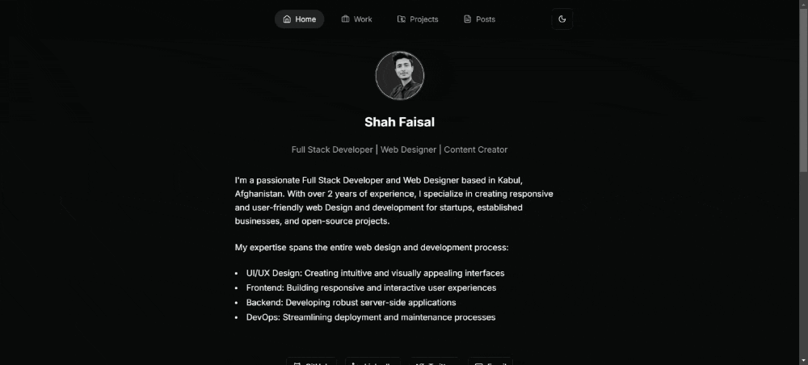

# Devfolio

Devfolio is a personal website built with modern web technologies. It showcases my skills, projects, and blog posts as a Full Stack Developer and Web Designer.

## Technologies Used

- **Frontend Framework**: [Next.js](https://nextjs.org/) (React)
- **Styling**: [Tailwind CSS](https://tailwindcss.com/)
- **Content Management**: Markdown for blog posts
- **Deployment**: [Vercel](https://vercel.com/)

### Key Libraries and Tools

- [React](https://reactjs.org/)
- [TypeScript](https://www.typescriptlang.org/)
- [date-fns](https://date-fns.org/) for date formatting
- [gray-matter](https://github.com/jonschlinkert/gray-matter) for parsing frontmatter in Markdown files
- [next-mdx-remote](https://github.com/hashicorp/next-mdx-remote) for rendering MDX content
- [next-themes](https://github.com/pacocoursey/next-themes) for dark mode support
- [Lucide React](https://lucide.dev/) for icons
- [Framer Motion](https://www.framer.com/motion/) for animations
- [react-syntax-highlighter](https://github.com/react-syntax-highlighter/react-syntax-highlighter) for code syntax highlighting

## Features

- Responsive design
- Dark/Light mode
- Blog with Markdown support
- Project showcase
- Work experience timeline
- Contact information

## Getting Started

To run this project locally:

1. Clone the repository

